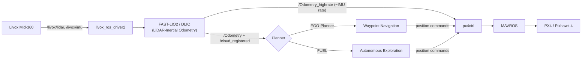

<div align="right">

**English** | [简体中文](README.zh-CN.md)

</div>

# UAV Autonomous Navigation Platform (250mm)

> **Current Status:** ✅ v1.2.0 Completed — FUEL Autonomous Exploration Reproduced on the Real Platform
> **Latest Version:** v1.2.0

## 📖 Introduction

This repository documents the iterative development of a custom **250mm wheelbase quadrotor** designed for advanced autonomous navigation and control research.

The goal is to build a robust hardware and software foundation, starting from classical SLAM and planning algorithms, and gradually migrating towards **end-to-end / learning-based** perception and control systems.

## 🎬 Demo

### v1.2.0 — FUEL Autonomous Exploration (real flight, 4× speed)

| FUEL — Frontier-based Autonomous Exploration in an unknown indoor corridor |
| :---: |
|  |
| [Full video](videos/FUEL_exploration.mp4) |

### v1.1.0 — LiDAR-Inertial Localization & Waypoint Navigation

| FAST-LIO2 Localization — Stable Hover | DLIO + EGO-Planner — Autonomous Waypoint Navigation (4× speed) |
| :---: | :---: |
|  |  |
| [Full video](videos/FASTLIO2.mp4) | [Full video](videos/DLIO+egoplanner.mp4) |

## 🛠️ Hardware Platform

The drone is built on a custom 250mm carbon fiber frame, featuring a high-performance compute module for onboard AI processing.

| Component | Model / Specs | Note |
| :--- | :--- | :--- |
| **Onboard Computer** | **NVIDIA Jetson Orin NX (8GB)** | Core computing unit |
| **Flight Controller**| **Holybro Pixhawk 4** | 32-bit, running PX4/ArduPilot |
| **LiDAR** | **Livox Mid-360** | Omnidirectional 3D LiDAR |
| **Depth Camera** | **Intel RealSense D435** | For VIO and depth sensing |
| **Frame** | **Custom Carbon Fiber (250mm)** | "Taobao" Custom Cut |
| **Motors** | **Koofly 2207 V2 (1960KV)** | 4S Power System |
| **ESC** | **EMAX BLHeli32 (45A)** | 4-in-1 ESC supported |
| **Battery** | **Gens Ace 4S 4000mAh** | Long endurance for computing |
| **Propellers** | **Gemfan 5147 (3-blade)** | Efficient 5-inch props |
| **RC System** | **RadioLink AT9S Pro + R12DSM** | Reliable control link |

📄 **For a complete list of parts, cables, and tools, please check the [BOM List](./BOM.xlsx).**

## 🧩 Software Architecture



The same LiDAR-inertial localization front-end feeds two interchangeable planners:

- **Localization** (`Drone/localization/`) — FAST-LIO2 or DLIO, both publishing `/Odometry` + `/Odometry_highrate` + `/cloud_registered`.
- **EGO-Planner** (`Drone/planner/ego_planner/`) — point-to-point / waypoint navigation. Start with `scripts/run_fastlio_ego_px4.sh` or `scripts/run_dlio_ego_px4.sh`.
- **FUEL** (`Drone/planner/FUEL/`) — frontier-based autonomous exploration of unknown environments.

### Key Modifications vs. Upstream

| Module | Upstream (pinned commit) | What was changed here |
| :--- | :--- | :--- |
| **FAST-LIO2** (`Drone/localization/fast_lio2_ws`) | [hku-mars/FAST_LIO](https://github.com/hku-mars/FAST_LIO) `7cc4175` | ① **High-rate odometry**: new `PropagateHighRateState()` forward-propagates the latest LIO state with each incoming IMU sample and publishes `/Odometry_highrate` (~IMU rate) for `px4ctrl`, instead of the ~10 Hz LiDAR-rate `/Odometry`. ② Ported from `livox_ros_driver` to `livox_ros_driver2`. ③ Mid-360 config tuning (`config/mid360.yaml`). |
| **DLIO** (`Drone/localization/dlio_ws`) | [vectr-ucla/direct_lidar_inertial_odometry](https://github.com/vectr-ucla/direct_lidar_inertial_odometry) `fc8d183` | ① New `imu/accelScale` parameter — the Mid-360 IMU reports acceleration in **g**, not m/s², so it is rescaled by 9.80665. ② Mid-360 extrinsics in `cfg/dlio.yaml` (aligned with FAST-LIO2's `mid360.yaml`). ③ New `launch/dlio_mid360_drone.launch` remaps DLIO outputs to `/Odometry_highrate` + `/cloud_registered`, making DLIO a drop-in replacement for FAST-LIO2 in the same stack. |
| **EGO-Planner** (`Drone/planner/ego_planner`, from [Fast-Drone-250](https://github.com/ZJU-FAST-Lab/Fast-Drone-250) `8ff6427`) | launch/config | ① Odometry source switched from VINS-Fusion (`/vins_fusion/imu_propagate`) to LIO (`/Odometry`). ② `grid_map` is built directly from the LiDAR registered cloud (`cloud_registered`) instead of the depth camera. ③ `max_acc` lowered 6.0 → 2.0 for safe indoor flight. Full diff in `patches/`. |
| **FUEL** (`Drone/planner/FUEL`) | [HKUST-Aerial-Robotics/FUEL](https://github.com/HKUST-Aerial-Robotics/FUEL) `662dd23` | Frontier-based autonomous exploration reproduced on the real platform: takes the Mid-360 LiDAR cloud + LIO odometry as input and drives exploration through `exploration_real.launch`. Reproduced and verified in a real indoor corridor (see demo). |
| **livox_ros_driver2** | [Livox-SDK/livox_ros_driver2](https://github.com/Livox-SDK/livox_ros_driver2) `6b9356c` | **Not vendored** — use upstream directly. Only the network config differs: see `config/livox/MID360_config.json` (host `192.168.1.50`, LiDAR `192.168.1.154`). |

> `patches/` contains the exact diffs of the localization / EGO-Planner modules against their pinned upstream commits, for review and re-application.

## 📂 Repository Structure

```text
.
├── README.md / README.zh-CN.md       # This file (EN) / Chinese version
├── BOM.xlsx                          # Detailed hardware Bill of Materials
├── docs/assets/                      # Demo GIFs embedded above
├── videos/                           # Full-length demo videos (mp4)
├── Drone/
│   ├── localization/
│   │   ├── fast_lio2_ws/             # Modified FAST-LIO2 (high-rate odom, driver2 port)
│   │   └── dlio_ws/                  # Modified DLIO (accelScale, Mid-360 launch)
│   └── planner/
│       ├── ego_planner/              # EGO-Planner extracted from Fast-Drone-250 (waypoint nav)
│       └── FUEL/                     # FUEL frontier-based autonomous exploration
├── config/
│   ├── livox/                        # Mid-360 network config for livox_ros_driver2
│   └── px4ctrl/                      # px4ctrl control params + launch
├── patches/                          # Diffs vs. pinned upstream commits
└── scripts/                          # One-shot startup / takeoff / record scripts
```

## 🚀 Quick Start (on the drone, ROS Noetic)

```bash
# 1. Build the Livox driver (upstream) with the config from this repo
#    livox_ws/src/livox_ros_driver2  @ 6b9356c, replace config/MID360_config.json

# 2. Build the localization workspaces from this repo's sources
#    Drone/localization/fast_lio2_ws   (catkin build)
#    Drone/localization/dlio_ws        (catkin build)

# 3a. Waypoint navigation: build Drone/planner/ego_planner, then launch the full stack
./scripts/run_fastlio_ego_px4.sh    # FAST-LIO2 + EGO-Planner pipeline
./scripts/run_dlio_ego_px4.sh       # or: DLIO + EGO-Planner pipeline

# 3b. Autonomous exploration: build Drone/planner/FUEL, then
roslaunch exploration_manager exploration_real.launch

# 4. After all topics are healthy, take off
./scripts/takeoff.sh
```

## 🗺️ Roadmap & Versions

### ✅ v1.0.0: The Visual Baseline
**Focus:** Establishing a stable flight platform using Visual-Inertial Odometry (VIO).
* **Localization:** [VINS-Fusion](https://github.com/HKUST-Aerial-Robotics/VINS-Fusion) (Stereo + IMU)
* **Planning:** [EGO-Planner](https://github.com/ZJU-FAST-Lab/ego-planner)
* **Key Hardware:** Jetson NX + D435

### ✅ v1.1.0: LiDAR-Inertial Upgrade
**Focus:** Integrating Livox Mid-360 for robust, high-precision localization in complex environments.
* **Localization:** [FAST-LIO2](https://github.com/hku-mars/FAST_LIO) / [DLIO](https://github.com/vectr-ucla/direct_lidar_inertial_odometry) (LiDAR-Inertial Odometry) with Livox Mid-360
* **Planning:** [EGO-Planner](https://github.com/ZJU-FAST-Lab/ego-planner) for waypoint (fixed-point) navigation
* **Result:** Stable indoor localization (hover) and autonomous waypoint navigation verified on the real platform.

### ✅ v1.2.0: Autonomous Exploration (Completed)
**Focus:** From waypoint navigation to fully autonomous exploration of unknown environments.
* **Autonomous Exploration:** [FUEL](https://github.com/HKUST-Aerial-Robotics/FUEL) (Fast UAV ExpLoration) reproduced on the real platform, driven by Mid-360 LiDAR + LIO odometry.
* **Result:** Frontier-based autonomous exploration verified in a real indoor corridor — see the demo GIF above.

### 🚀 v2.0.0: End-to-End Navigation Deployment (Next Target)
**Focus:** Move from modular SLAM + planning toward learning-based, end-to-end navigation on the real drone.
* Deploy an **end-to-end navigation policy** (learning-based perception → action) onboard the Jetson.
* **Sim-to-Real** transfer for the navigation policy.
* Integration of neural perception modules with the existing LiDAR-inertial localization stack.

## 🙏 Acknowledgements

This project builds on the excellent open-source work of
[hku-mars/FAST_LIO](https://github.com/hku-mars/FAST_LIO),
[vectr-ucla/direct_lidar_inertial_odometry](https://github.com/vectr-ucla/direct_lidar_inertial_odometry),
[ZJU-FAST-Lab/Fast-Drone-250](https://github.com/ZJU-FAST-Lab/Fast-Drone-250) (EGO-Planner),
[HKUST-Aerial-Robotics/FUEL](https://github.com/HKUST-Aerial-Robotics/FUEL),
and [Livox-SDK/livox_ros_driver2](https://github.com/Livox-SDK/livox_ros_driver2).
