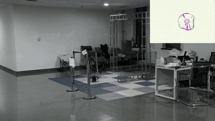
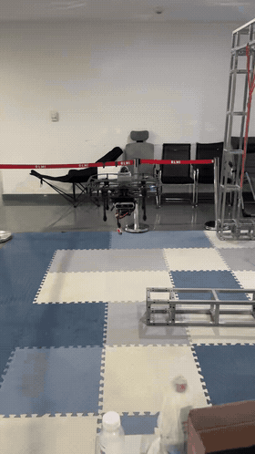
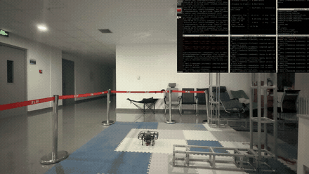
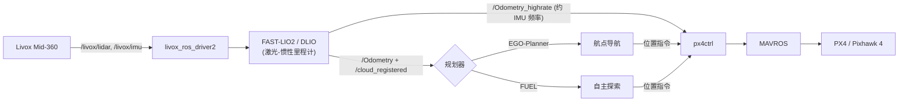

<div align="right">

[English](README.md) | **简体中文**

</div>

# 无人机自主导航平台(250mm)

> **当前状态:** ✅ v1.2.0 已完成 — FUEL 自主探索实机复现
> **最新版本:** v1.2.0

## 📖 项目简介

本仓库记录一台自研 **250mm 轴距四旋翼** 的迭代开发过程,面向自主导航与控制研究。

目标是先用经典 SLAM 与规划算法搭建稳定可靠的软硬件底座,再逐步过渡到**端到端 / 学习驱动**的感知与控制系统。

## 🎬 演示

### v1.2.0 — FUEL 自主探索(实机,4 倍速)

| FUEL — 未知室内走廊中的 frontier 自主探索 |
| :---: |
|  |
| [完整视频](videos/FUEL_exploration.mp4) |

### v1.1.0 — 激光-惯性定位与航点导航

| FAST-LIO2 定位 — 稳定悬停 | DLIO + EGO-Planner — 自主航点导航(4 倍速) |
| :---: | :---: |
|  |  |
| [完整视频](videos/FASTLIO2.mp4) | [完整视频](videos/DLIO+egoplanner.mp4) |

## 🛠️ 硬件平台

机架为定制 250mm 碳纤维结构,搭载高性能机载计算单元用于在线 AI 处理。

| 部件 | 型号 / 规格 | 说明 |
| :--- | :--- | :--- |
| **机载计算机** | **NVIDIA Jetson Orin NX (8GB)** | 核心计算单元 |
| **飞控** | **Holybro Pixhawk 4** | 32 位,运行 PX4/ArduPilot |
| **激光雷达** | **Livox Mid-360** | 全向 3D 激光雷达 |
| **深度相机** | **Intel RealSense D435** | VIO 与深度感知 |
| **机架** | **定制碳纤维(250mm)** | 淘宝定制切割 |
| **电机** | **Koofly 2207 V2 (1960KV)** | 4S 动力系统 |
| **电调** | **EMAX BLHeli32 (45A)** | 支持四合一电调 |
| **电池** | **Gens Ace 4S 4000mAh** | 长续航支撑机载计算 |
| **桨叶** | **Gemfan 5147(三叶)** | 高效 5 寸桨 |
| **遥控系统** | **RadioLink AT9S Pro + R12DSM** | 可靠控制链路 |

📄 **完整零件、线材与工具清单见 [BOM 物料表](./BOM.xlsx)。**

## 🧩 软件架构



同一套激光-惯性定位前端可对接两种可互换的规划器:

- **定位**(`Drone/localization/`)— FAST-LIO2 或 DLIO,均发布 `/Odometry` + `/Odometry_highrate` + `/cloud_registered`。
- **EGO-Planner**(`Drone/planner/ego_planner/`)— 点到点 / 航点导航。用 `scripts/run_fastlio_ego_px4.sh` 或 `scripts/run_dlio_ego_px4.sh` 启动。
- **FUEL**(`Drone/planner/FUEL/`)— 未知环境下基于 frontier 的自主探索。

### 相对上游的关键修改

| 模块 | 上游(锁定 commit) | 本仓库的修改 |
| :--- | :--- | :--- |
| **FAST-LIO2**(`Drone/localization/fast_lio2_ws`) | [hku-mars/FAST_LIO](https://github.com/hku-mars/FAST_LIO) `7cc4175` | ① **高频里程计**:新增 `PropagateHighRateState()`,在每个 IMU 回调中对最新 LIO 状态做前向传播,发布约 IMU 频率的 `/Odometry_highrate` 供 `px4ctrl` 使用,替代约 10 Hz 的雷达帧率 `/Odometry`。② 依赖从 `livox_ros_driver` 移植到 `livox_ros_driver2`。③ Mid-360 配置调优(`config/mid360.yaml`)。 |
| **DLIO**(`Drone/localization/dlio_ws`) | [vectr-ucla/direct_lidar_inertial_odometry](https://github.com/vectr-ucla/direct_lidar_inertial_odometry) `fc8d183` | ① 新增 `imu/accelScale` 参数 — Mid-360 的 IMU 加速度输出单位是 **g** 而非 m/s²,按 9.80665 换算。② `cfg/dlio.yaml` 写入 Mid-360 外参(与 FAST-LIO2 的 `mid360.yaml` 对齐)。③ 新增 `launch/dlio_mid360_drone.launch`,把 DLIO 输出重映射为 `/Odometry_highrate` + `/cloud_registered`,实现对 FAST-LIO2 的即插即用替换。 |
| **EGO-Planner**(`Drone/planner/ego_planner`,来自 [Fast-Drone-250](https://github.com/ZJU-FAST-Lab/Fast-Drone-250) `8ff6427`) | launch/配置 | ① 里程计源从 VINS-Fusion(`/vins_fusion/imu_propagate`)切换为 LIO(`/Odometry`)。② `grid_map` 直接由激光注册点云(`cloud_registered`)构建,不再依赖深度相机。③ `max_acc` 从 6.0 降到 2.0,保证室内飞行安全。完整 diff 见 `patches/`。 |
| **FUEL**(`Drone/planner/FUEL`) | [HKUST-Aerial-Robotics/FUEL](https://github.com/HKUST-Aerial-Robotics/FUEL) `662dd23` | 在实机上复现 frontier 自主探索:以 Mid-360 激光点云 + LIO 里程计为输入,通过 `exploration_real.launch` 驱动探索。已在真实室内走廊复现并验证(见演示)。 |
| **livox_ros_driver2** | [Livox-SDK/livox_ros_driver2](https://github.com/Livox-SDK/livox_ros_driver2) `6b9356c` | **不收录源码** — 直接使用上游。唯一差异是网络配置:见 `config/livox/MID360_config.json`(主机 `192.168.1.50`,雷达 `192.168.1.154`)。 |

> `patches/` 内含定位 / EGO-Planner 各模块相对其锁定上游 commit 的精确 diff,便于审阅与重新应用。

## 📂 仓库结构

```text
.
├── README.md / README.zh-CN.md       # 英文版 / 本文件
├── BOM.xlsx                          # 硬件物料清单
├── docs/assets/                      # 上方内嵌的演示 GIF
├── videos/                           # 完整演示视频(mp4)
├── Drone/
│   ├── localization/
│   │   ├── fast_lio2_ws/             # 修改版 FAST-LIO2(高频里程计、driver2 移植)
│   │   └── dlio_ws/                  # 修改版 DLIO(accelScale、Mid-360 launch)
│   └── planner/
│       ├── ego_planner/              # 从 Fast-Drone-250 提取的 EGO-Planner(航点导航)
│       └── FUEL/                     # FUEL 基于 frontier 的自主探索
├── config/
│   ├── livox/                        # Mid-360 网络配置(livox_ros_driver2)
│   └── px4ctrl/                      # px4ctrl 控制参数 + launch
├── patches/                          # 相对上游锁定 commit 的 diff
└── scripts/                          # 一键启动 / 起飞 / 录包脚本
```

## 🚀 快速开始(机载端,ROS Noetic)

```bash
# 1. 编译 Livox 驱动(上游源码)并替换本仓库的网络配置
#    livox_ws/src/livox_ros_driver2  @ 6b9356c,替换 config/MID360_config.json

# 2. 用本仓库源码编译两个定位工作空间
#    Drone/localization/fast_lio2_ws   (catkin build)
#    Drone/localization/dlio_ws        (catkin build)

# 3a. 航点导航:编译 Drone/planner/ego_planner,然后一键启动整套系统
./scripts/run_fastlio_ego_px4.sh    # FAST-LIO2 + EGO-Planner 流水线
./scripts/run_dlio_ego_px4.sh       # 或:DLIO + EGO-Planner 流水线

# 3b. 自主探索:编译 Drone/planner/FUEL,然后
roslaunch exploration_manager exploration_real.launch

# 4. 确认所有话题正常后起飞
./scripts/takeoff.sh
```

## 🗺️ 路线图与版本

### ✅ v1.0.0:视觉基线
**重点:** 用视觉-惯性里程计(VIO)搭建稳定飞行平台。
* **定位:** [VINS-Fusion](https://github.com/HKUST-Aerial-Robotics/VINS-Fusion)(双目 + IMU)
* **规划:** [EGO-Planner](https://github.com/ZJU-FAST-Lab/ego-planner)
* **核心硬件:** Jetson NX + D435

### ✅ v1.1.0:激光-惯性升级(已完成)
**重点:** 集成 Livox Mid-360,实现复杂环境下鲁棒的高精度定位。
* **定位:** [FAST-LIO2](https://github.com/hku-mars/FAST_LIO) / [DLIO](https://github.com/vectr-ucla/direct_lidar_inertial_odometry)(激光-惯性里程计)+ Livox Mid-360
* **规划:** [EGO-Planner](https://github.com/ZJU-FAST-Lab/ego-planner) 航点(定点)导航
* **结果:** 实机验证室内稳定定位(悬停)与自主航点导航。

### ✅ v1.2.0:自主探索(已完成)
**重点:** 从航点导航走向未知环境的全自主探索。
* **自主探索:** 在实机上复现 [FUEL](https://github.com/HKUST-Aerial-Robotics/FUEL)(Fast UAV ExpLoration),以 Mid-360 激光 + LIO 里程计驱动。
* **结果:** 在真实室内走廊验证基于 frontier 的自主探索 — 见上方演示 GIF。

### 🚀 v2.0.0:端到端导航部署(下一目标)
**重点:** 从模块化 SLAM + 规划走向实机上的学习驱动、端到端导航。
* 在 Jetson 上部署**端到端导航策略**(学习驱动的感知 → 动作)。
* 导航策略的 **Sim-to-Real** 迁移。
* 神经感知模块与现有激光-惯性定位栈的集成。

## 🙏 致谢

本项目基于以下优秀开源工作:
[hku-mars/FAST_LIO](https://github.com/hku-mars/FAST_LIO)、
[vectr-ucla/direct_lidar_inertial_odometry](https://github.com/vectr-ucla/direct_lidar_inertial_odometry)、
[ZJU-FAST-Lab/Fast-Drone-250](https://github.com/ZJU-FAST-Lab/Fast-Drone-250)(EGO-Planner)、
[HKUST-Aerial-Robotics/FUEL](https://github.com/HKUST-Aerial-Robotics/FUEL)、
[Livox-SDK/livox_ros_driver2](https://github.com/Livox-SDK/livox_ros_driver2)。
